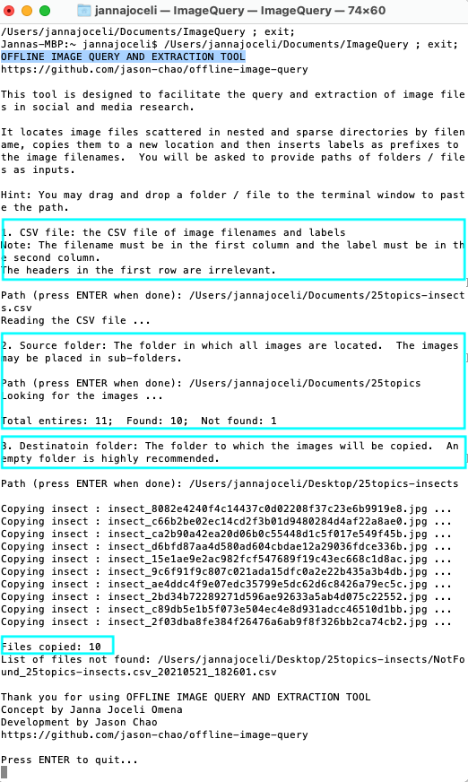
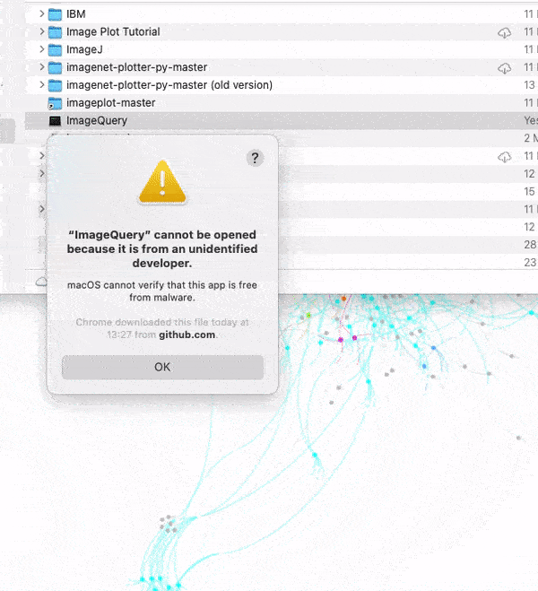
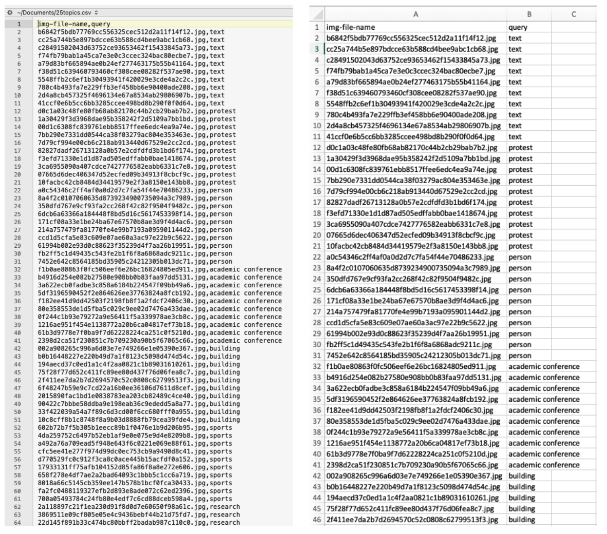

# Offline Image Query and Extraction Tool

Offline Image Query and Extraction Tool serves the study of visual content for social or media research but it is not limited to this purpose. It allows researchers to use the image name file as query, helping them to navigate visual content according to its different characteristics, such as:

* Image query according to user accounts or link domains (the site of image creation or appearance) 
* Image query according to engagement metrics, e.g. shares, comments, views, likes, re-tweets, etc. (the site of image audiencing)
* Image query according to computer vision outputs, e.g. labels, top-level link domains, web entities, not safe for work content, etc. (the content of the image itself or sites of image circulation)
* Image query according to published time, date, month or year

This tool was created as a response to the short life of online image URLs, allowing researchers to explore and analyse specific collections of images on demand. 

The tool runs on Windows, mac OS and Linux.  Technically, the tool locates image files scattered in nested and sparse directories by filename, copies them to a new location and then inserts labels as prefixes to the image filenames.

If you use this tool in a scientific publication, please cite it, e.g. in APA style: *Chao, T. H. J. & Omena, J. J.  (2021).  Offline Image Query and Extraction Tool (Version 0.1) [Software]. Available from https://github.com/jason-chao/offline-image-query.*

## A word of recommendation

To successfully make use of the Image Query Tool, we recommend researchers to download all images as soon as they complete the data collection process. In this way, and considering the short life span of image URLs, it is thus ensured that the images will be available for analysis.

## Download

Downlaod [the latest version of Offline Image Query and Extraction Tool for Windows, Mac OS or Linux](https://github.com/jason-chao/offline-image-query/releases/).

On Mac OS, open OfflineImageQuery extracted from the zip file.  If Mac OS declines to run ImageQuery, go to `System Preferences` > `Security & Privacy` and then click `Open Anyway` to allow the tool to run.

On Windows, open OfflineImageQuery.exe extracted from the zip file.  If Windows shows you that the app "might put your PC at risk", click `More info` > `Run anyway`.

## How to use?

Read the following steps or [📺 watch the video](https://youtu.be/gp7a8hj40Po)

*Note on naming of file / folder on MacOS and Linux:  Please remove any backslash (\\), quotation mark (' or ") and trailing whitespace from the name of the file or folder to be dragged into the tool.  The tool might not correctly recongise the path due to system behaviour.*

* Make sure you have a CSV (comma separated values) file and a folder of images located in your computer. 
  * Note: The filename must be in the first column and the label must be in the second column.
  * The headers in the first row are irrelevant.

* Depending on the original dataset, the images can be filtered by high or low engagement metrics (e.g. likes, shares, comments), user accounts, link domains, computer vision outputs, etc.
  * The example below shows images filtered by labels attributed by computer vision.

* Open Offline Image Query and Extraction Tool, then drag and drop the .csv file to it and press enter.

* Drag and drop the source folder: the folder in which all images are located.
  * Important note: the images may be placed in sub-folders. For example, if you need to query multiple folders of images located on Documents, you can simply drag and drop the Document folders to Image Query.
  * Image Query would inform the total number of query, how many images were found and not found.

* Create an empty folder, named it according to your project.

*  Drag and drop the destination folder to Image Query and press enter.
  * This is the folder to which the images will be copied.
  * You can visualise and navigate your image query using [ImageSorter](https://visual-computing.com/project/imagesorter/).

## Credits

Concept by [Janna Joceli Omena](https://github.com/jannajoceli)

Development by [Jason Chao](https://github.com/jason-chao)
